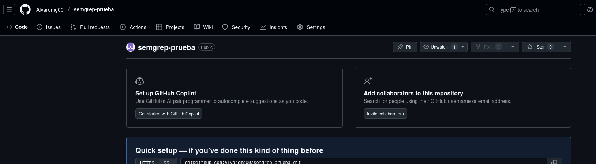
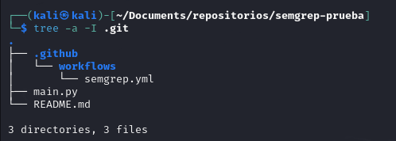
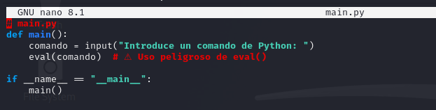
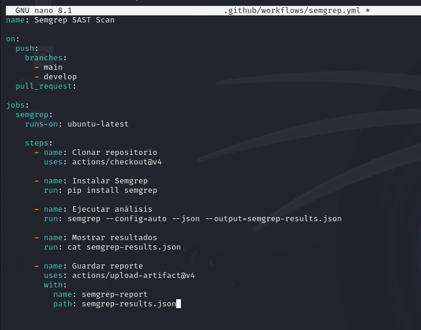
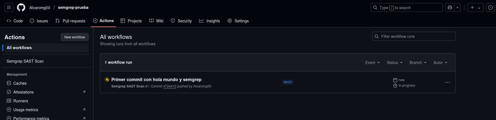
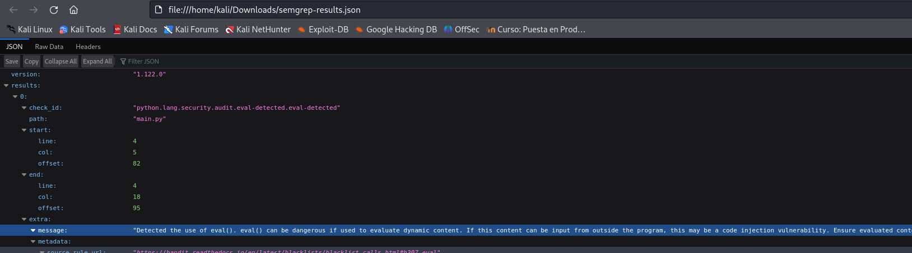
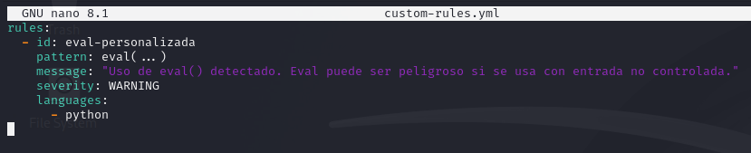
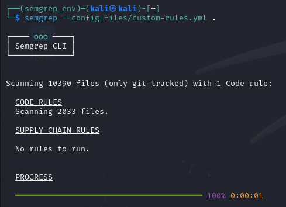
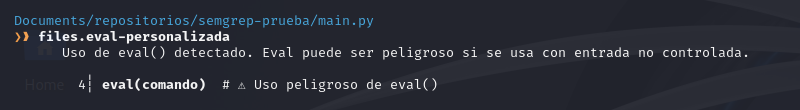
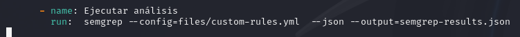

# Análisis de Código Estático con SAST (Static Application Security Testing)

**SAST** (Static Application Security Testing) es una técnica que permite analizar el código fuente de una aplicación para detectar vulnerabilidades antes de su despliegue. No requiere ejecutar el software, lo que permite encontrar errores de forma temprana en el ciclo de desarrollo.

### ¿Qué es Semgrep?

Semgrep (Security Enhanced Multi-Grep) es una herramienta de análisis estático de código fuente. A diferencia de grep, Semgrep entiende la estructura del código y es capaz de detectar patrones de vulnerabilidades y malas prácticas.

**Ventajas:**

- ✅ Detecta vulnerabilidades automáticamente
- 🔁 Se puede integrar en pipelines CI/CD
- 🌐 Soporta múltiples lenguajes (JavaScript, Python, Go, Java, etc.)
- 🛠️ Permite definir reglas personalizadas

### Objetivo

- Usar SAST para detectar problemas de seguridad en el código sin ejecutarlo.
- Conocer los qué es un entorno CI/CD: Integración Continua/Entrega Continua

### Análisis automático del código:

Lanzamos el análisis automático con **semgrep**:

Nos indica que ha encontrado 188 problemas:

Ahora lanzamos el análisis vulnerabilidades basadas en las 10 amenazas más críticas de OWASP:

Indica que ha encontrado 44 problemas, aqui hay alguno de ellos:

### Integración de Semgrep en GitHub Actions

Creamos un repositorio llamado **semgrep-prueba**:

Lo clonamos y dentro creamos la siguiente estructura de ficheros y directorios:

Ponemos el siguiente código en **main.py**:

Y en **semgrep.yml**:

Esto hace que se ejecute Semgrep en cada push y pull request.

Hacemos un commit y push para probar y en Github nos vamos a el apartado de actions para ver el pipeline en ejecución:

Una vez completado nos podemos descargar el json y consultarlo:

Nos habla sobre el problema introducido por el uso de **eval()**.

### Crear reglas personalizadas

Podemos crear nuestro propio archivo de reglas para realizar un análisis estático con semgrep:

Y lanzamos el análisis estático sobre nuestro repositorio de **semgrep-prueba**:

Como vemos nos aparece el aviso indicado en la regla:

Modificamos la ejecución de semgrep, en vez de ejecutar con las reglas por defecto, lo hacemos con las reglas personalizadas.

Para ello tenemos que indicarle que el conjunto de reglas a aplicar es el que hemos creado

