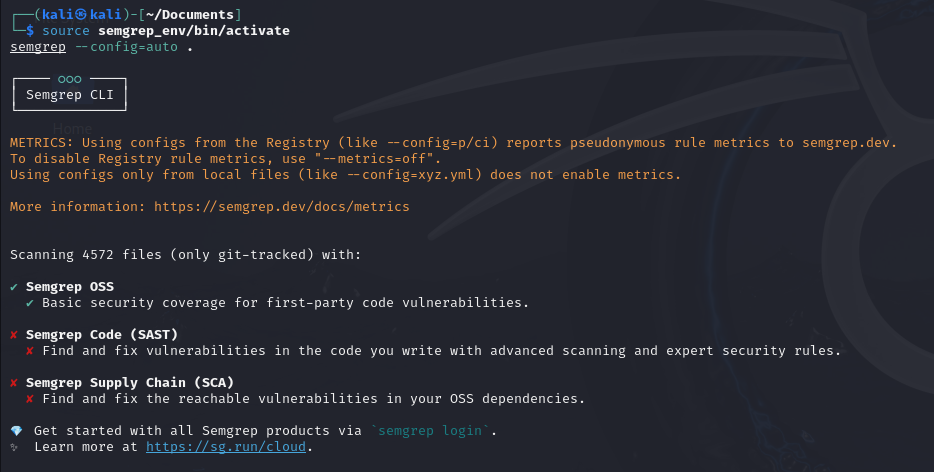
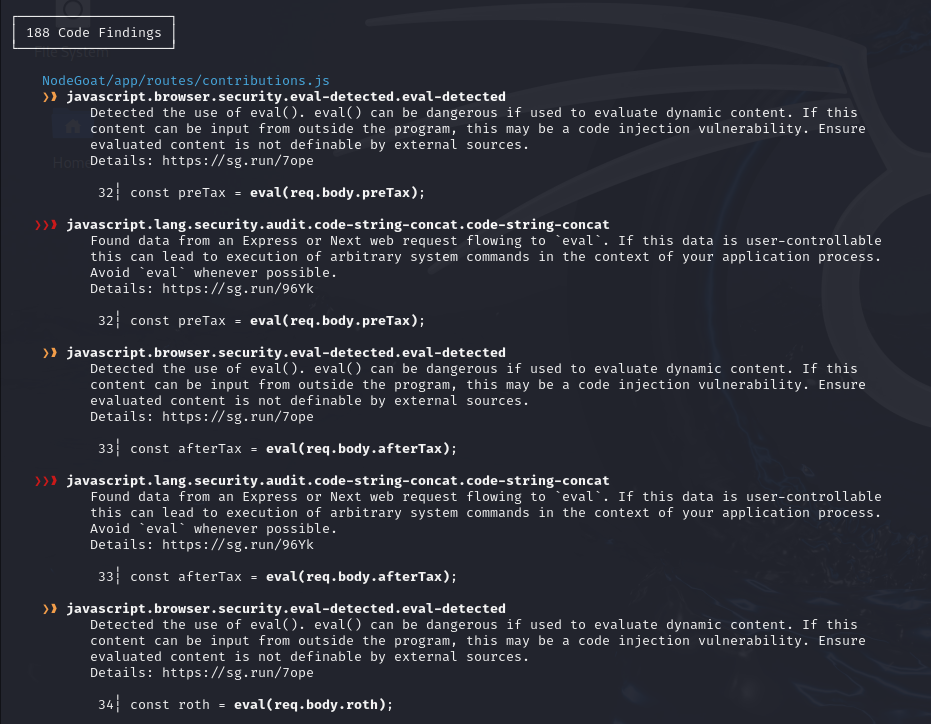
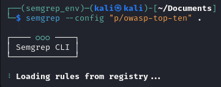
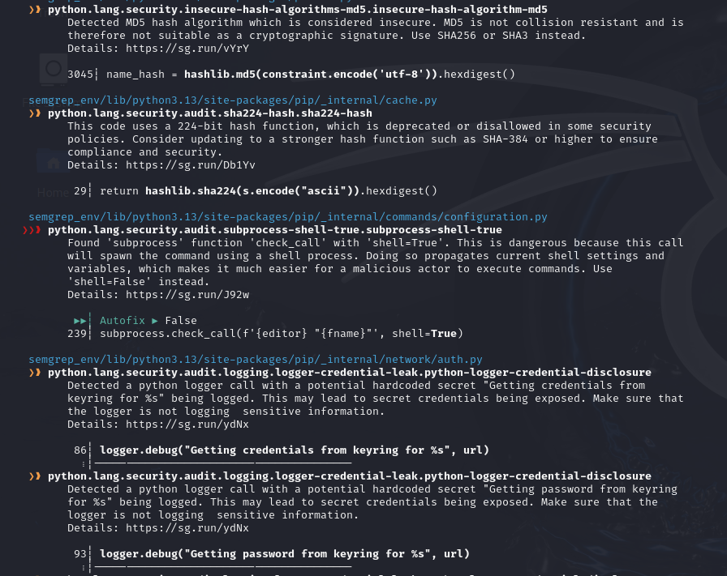

# Análisis de Código Estático con SAST (Static Application Security Testing)

**SAST** (Static Application Security Testing) es una técnica que permite analizar el código fuente de una aplicación para detectar vulnerabilidades antes de su despliegue. No requiere ejecutar el software, lo que permite encontrar errores de forma temprana en el ciclo de desarrollo.

### ¿Qué es Semgrep?

Semgrep (Security Enhanced Multi-Grep) es una herramienta de análisis estático de código fuente. A diferencia de grep, Semgrep entiende la estructura del código y es capaz de detectar patrones de vulnerabilidades y malas prácticas.

**Ventajas:**

- ✅ Detecta vulnerabilidades automáticamente
- 🔁 Se puede integrar en pipelines CI/CD
- 🌐 Soporta múltiples lenguajes (JavaScript, Python, Go, Java, etc.)
- 🛠️ Permite definir reglas personalizadas

### Objetivo

- Usar SAST para detectar problemas de seguridad en el código sin ejecutarlo.
- Conocer los qué es un entorno CI/CD: Integración Continua/Entrega Continua

### Análisis automático del código:

Lanzamos el análisis automático con **semgrep**:

Nos indica que ha encontrado 188 problemas:

Ahora lanzamos el análisis vulnerabilidades basadas en las 10 amenazas más críticas de OWASP:

